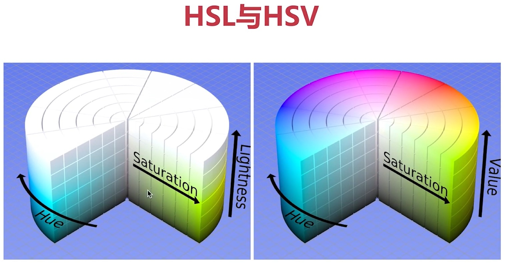
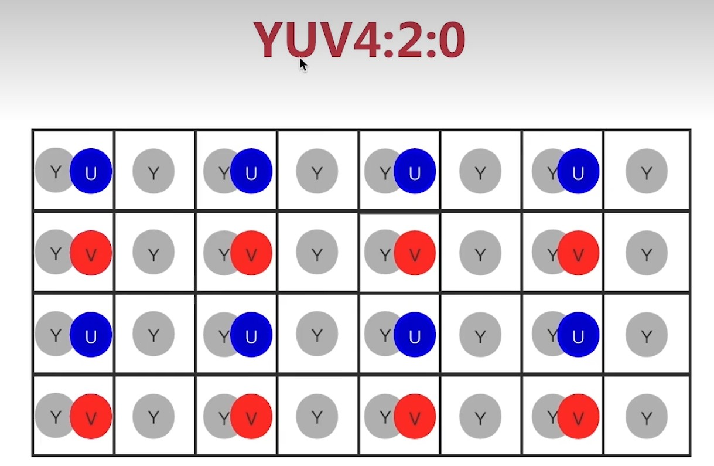
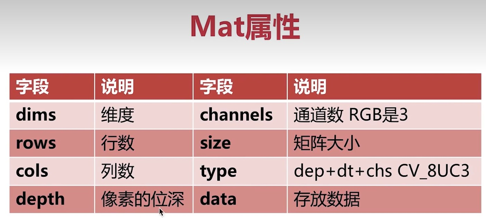

# 色彩空间变换
# 像素访问
# 矩阵的加减乘除
# 基本图形的绘制

### 色彩空间

    RGB ： 人眼的色彩空间
    OpenCV默认使用BGR
    HSV/HSB/HSL
    YUV : 视频领域

    1. HSV ：Hue ： 色相，即色彩，如红色、蓝色
          Saturation : 饱和度，颜色的纯度
          Value ： 明度

！[这是图片](img/HSV.jpg "Magic Gardens")

    为什么要使用HSV：方便判断色相

    2. HSV ：Hue ： 色相，即色彩，如红色、蓝色
          Saturation : 饱和度，颜色的纯度
          Lightness : 亮度

    3. YUV ：   YUV4：2：0
                YUV4：2：2
                YUV4：2：4

    
# Numpy

    OpenCV 中用到的矩阵都要转换成Numpy数组
    Numpy 是一个经高度优化的Python数值库

    创建数组 array() 
        eg. a = array([]) || a = array([ [], [] ])
    创建全0/1数组 zeros()/ones()
        eg. a = zeros((8, 3, 3), np.uint8)
    创建全值数组 full(n) //n为自己输入的值
        eg. a = full((8, 3, 3),255, np.uint8)
    创建单位正方形/非正方形数组 identity()/eye()
        eg. a = dentity(4)

    检索与赋值
    [y, x]

    [y, x, channel]

    获取子矩阵
    [y1:y2, x1:x2]

    [:,:] //全部矩阵

# Mat结构体！！重点！！ 

    class CV_EXPORTS Mat{
        public:
            ...
            int dims; //维数
            int roes, cols; //行列数
            uchar *data;    //存储数据的指针
            int *refcount; //引用计数
            ...
    }

Mat浅拷贝
MAt A
A = imread(file, IMREAD_COLOR)
Mat B(A)

Mat 深拷贝
cv::Mat::clone()
cv::Mat::copyTo()
copy()