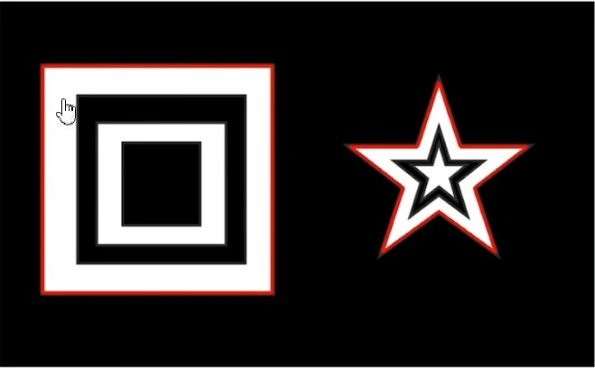
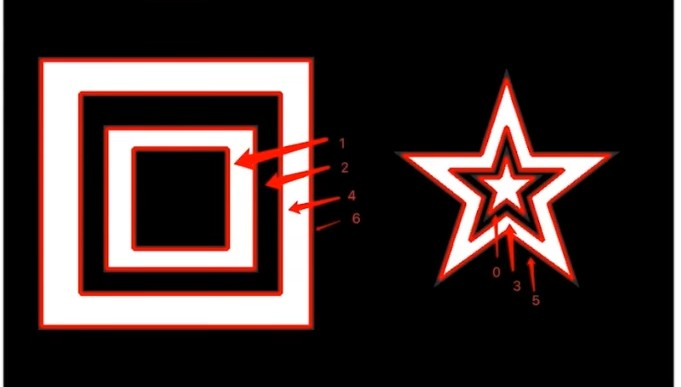
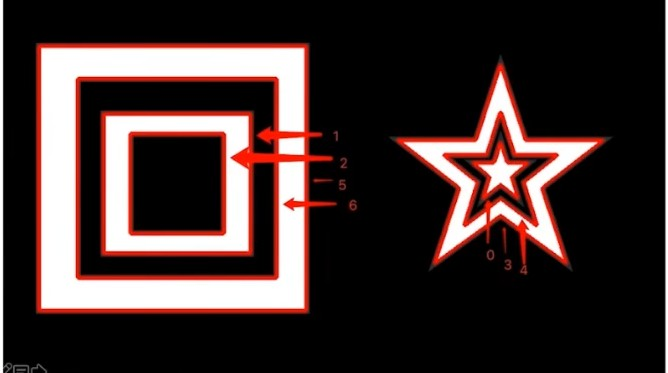
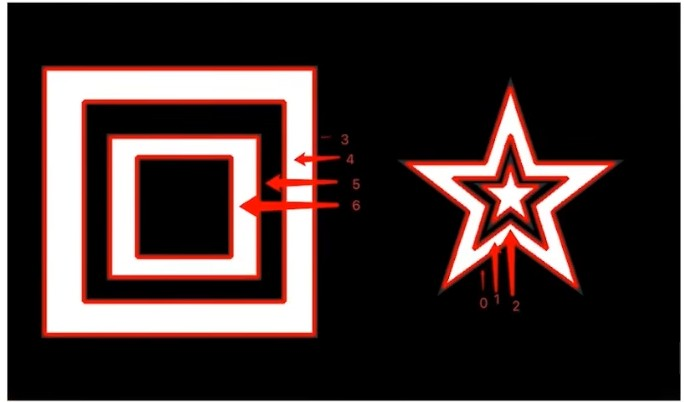

# 图像轮廓
    什么是图像轮廓
    图像轮廓是具有相同颜色或灰度的连续点的曲线.轮廓在形状分析和物体的检测和识别中很有用。

轮廓的作用:
    用于自形分析
    物体的识别和检测

注意点:
    为了检测的准确性，需要先对图像进行二值化或Canny操作
    画轮廓时会修改输入的图像,如果之后想继续使用原始图像，应该将原始图像储存到其他变量中

# 查找轮廓
    findContours(image, mode, method[, contours[, hierarchy[, offset]]])
        mode : 查找轮廓的模式
            RETR_EXTERNAL=0: 只检测外围轮廓

            RETR_EXTERNAL=1: 检测的轮廓不建立等级关系， 即检测所有轮廓

            RETR_EXTERNAL=2: 每层最多两级， 从小到大， 从里到外

            RETR_EXTERNAL=3: 按照树形存储轮廓， 从小到大， 从左到右

        method 轮廓近似方法也叫ApproximationMode
            CHAIN_APPROX_NONE : 保存所有轮廓上的点
            CHAIN_APPROX_SIMPLE : 只保存角点比如四边形只保留四边形的4个角,存储信息少,比较常用
            
        返回 contours和hierachy 即轮廓和层级