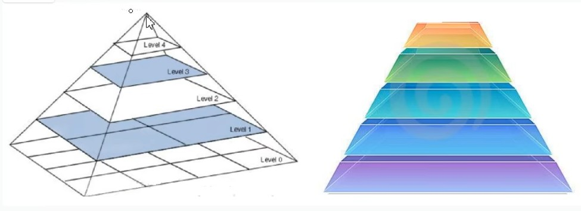
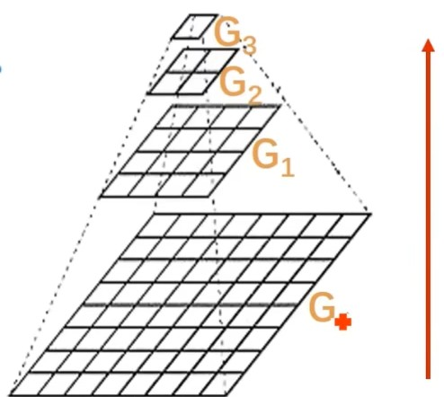
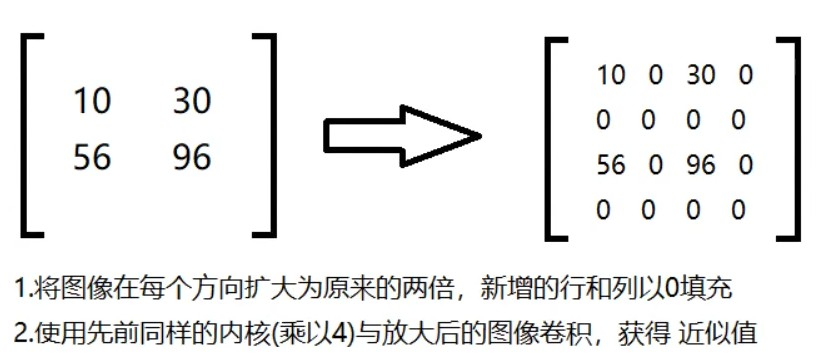
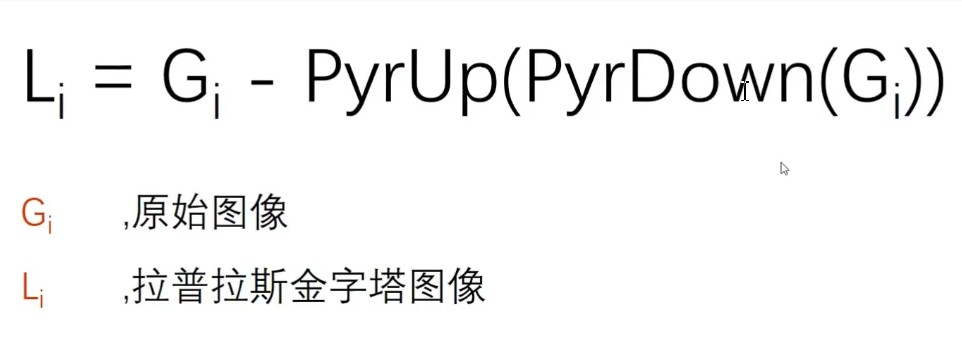
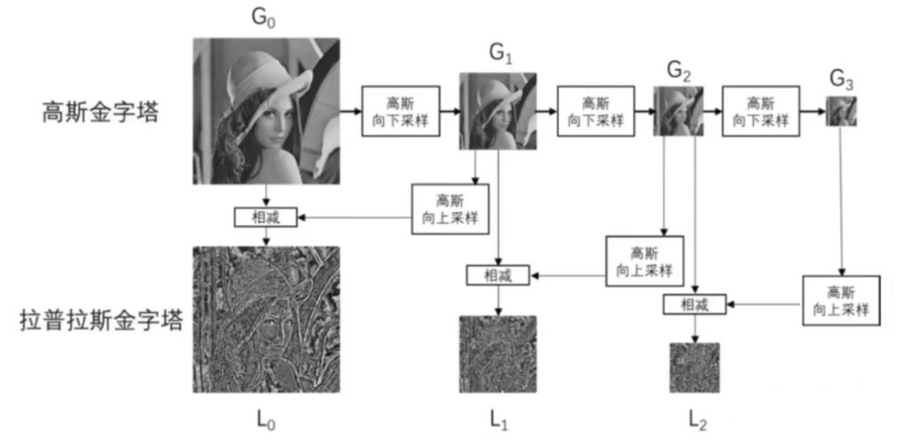
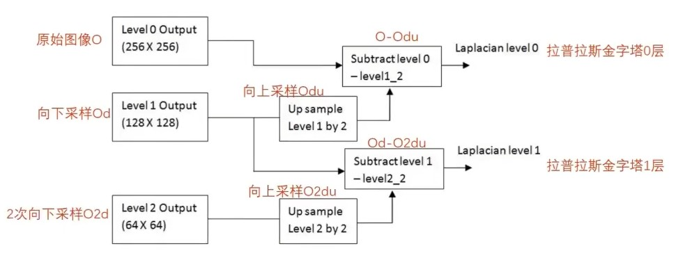

# 图像金字塔
## 图像金字塔介绍
    图像金字塔是图像中多尺度表达的一种，最主要用于图像的分割，是一种以多分辨率来解释图像的有效但概念简单的结构。简单来说,图像金字塔是同一图像不同分辨率的子图集合.

    图像金字塔最初用于机器视觉和图像压缩，一幅图像的金字塔是一系列以金字塔形状排列的分辨率逐步降低，目来源于同一张原始图的图像集合。其通过梯次向下采样获得，直到达到某个终止条件才停止采样。金字塔的底部是待处理图像的高分辨率表示，而顶部是低分辨率的近似。我们将一层一层的图像比喻成金字塔，层级越高，则图像越小，分辨率越低。

### 常见两类图像金字塔

    高斯金字塔(Gaussian pyramid): 用来向下/降采样，主要的图像金字塔

    拉普拉斯金字塔(Laplacian pyramid): 用来从金字塔低层图像重建上层未采样图像，在数字图像处理中也即是预测残差，可以对图像进行最大程度的还原，配合高斯金字塔一起使用。

## 高斯金字塔
高斯金字塔是通过高斯平滑和亚采样获得一系列下采样图像
原理非常简单,如下图所示:

原始图像 M * N -> 处理后图像 M/2 * N/2
每次处理后， 结果图像是原来的1/4

注意 ： 向下取样会丢失图像信息

    向上取样 ： 是向下取样的相反过程， 指图片从小变大的过程

    pyrDown 向下取样

# 拉普拉斯金字塔

将降采样之后的图像再进行上采样操作，然后与之前还没降采样的原图进行做差得到残差图!为还原图像做信息的准备!
也就是说，拉普拉斯金字塔是通过源图像减去先缩小后再放大的图像的一系列图像构成的。保留的是残差!
拉普拉斯金字塔是由高斯金字塔构成的,没有专门的函数
拉普拉斯金字塔图像是图像边缘,它的大部分元素都是0,用于图像压缩

