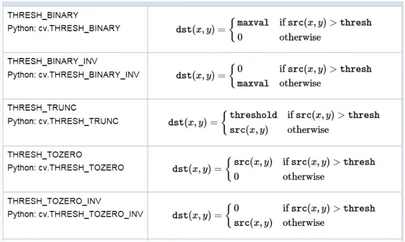
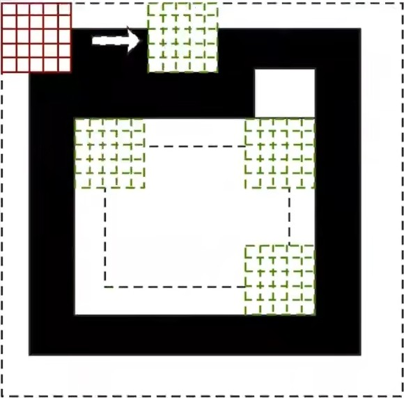
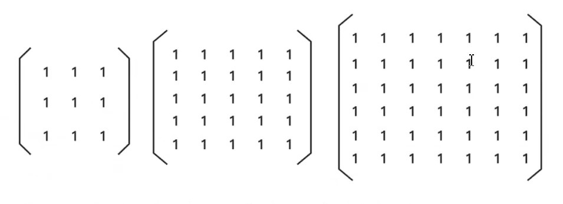

# 形态学概述
    什么是形态学
        1. 指一系列处理图像形状特征的图像处理技术
        2. 形态学的基本思想时利用一种特殊的结构元(本质上就是卷积核)来测量或提取输入图像中相应的形状或特征， 以便进一步进行图像分析和目标识别。
        3. 这些处理方法基本时对二进制图像进行处理， 即黑白图像
        4. 卷积核决定着图像处理后的效果
        5. 形态学常用操作有：
            膨胀与腐蚀、 开运算、 闭运算、 顶帽、 黑帽

# 图像全局二值化
    二值化： 将图像的每个像素变成两种值， 比如0， 255。
    threshold(src, thresh, maxval, type[, dst])
        src : 最好是灰度图
        thresh ： 阈值
        maxval ： 最大值， 不一定是255
        type ： 操作类型， 常见如下

# 自适应阈值二值化
    全局阈值，将整个图像采用同一个数作阈值。 但这核总方法并不使用所有情况， 尤其是在一副图像上 的不同部分的具有不同的亮度时， 这种情况需要采用自适应阈值， 此时的阈值是根据图像上的每一个小区域计算与其对应的阈值。 因此在一幅图像上的不同区域采用的是不同的阈值，从而能在亮度不同的情况下得到更好的结果。

    adaptiveThreshold(src, maxValue, adaptiveMethod, threshold, blockSize, C, dst=None)
        adaptiveMethod : 指定计算阈值的方法
            -cv2.ADAPTIVE_THRESH_MEAN_C : 阈值取自相邻区域的平均值
            -cv2.ADAPTIVE_THRESH_GAUSSIAN_C : 阈值取值相邻区域的加权和， 权重为一个高斯窗口。
        bolcksize : 邻域大小(用来计算阈值的区域大小)
        C ： 常数， 阈值等于平均值或者加权平均值减去这个常数

# 腐蚀操作
腐蚀操作也是用卷积核扫描图像， 只不过腐蚀操作的卷积核一般都是1， 如果卷积核内的所有像素点都是白色， 那么锚点即白色。

大部分腐蚀操作都是使用全为1的卷积核。

    erode(src, kernel[, dst[, anchor[, iterations[, borderType[, borderValue]]]]])
        iterations ： 腐蚀操作的迭代次数， 次数越多， 腐蚀效果越明显

# 获取形态学卷积核
    opencv提供了获取卷积核的api.不需要我们手工创建卷积核
        getStructuringElement(shape, ksize[, anchor])
            shape : 卷积核的形状注意不是指长宽是指卷积核中1形成的形状
                MORPH RECT卷积核中的1是矩形常用
                MORPH ELLIPSE圆
                MORPH CROSS 十字

# 膨胀操作
膨胀是腐蚀的相反操作，基本原理是只要保证卷积核的描点是非0值,周边无论是0还是非0值，都变成非0值

    dilate(img, kernel, iterations)

# 开运算
开运算和闭运算都是腐蚀和膨胀的基本应用.
开运算 = 腐蚀 + 膨胀
morphologyEx(img,MORPH_OPEN, kernel)
    MORPH_OPEN 表示形态学的开运算
    kernel 如果噪点比较多,会选择大一点的kernel,如果噪点比较小可以选择小点的kernel

# 闭运算
闭运算和闭运算都是腐蚀和膨胀的基本应用.
闭运算 = 膨胀 + 腐蚀
morphologyEx(img,MORPH_CLOSE, kernel)
    MORPH_OPEN 表示形态学的开运算
    kernel 如果噪点比较多,会选择大一点的kernel,如果噪点比较小可以选择小点的kernel

# 形态学梯度
梯度 =原图- 腐蚀
腐蚀之后原图边缘变小了，原图-腐蚀 就可以得到腐蚀掉的部分，即边缘，也可以说是轮廓。
    morphologyEx(img,MORPH_GRADIENT, kernel, iterations)

# 顶帽运算
顶帽 = 原图- 开运算
开运算的效果是去除图像外的噪点原图-开运算就得到了去掉的噪点
    morphologyEx(img,MORPH_TOPHAT, kernel, iterations)