# 卷积

1. 图片卷积 ： 就是卷积核在图像上按行滑动遍历像素时不断的相乘就和的过程
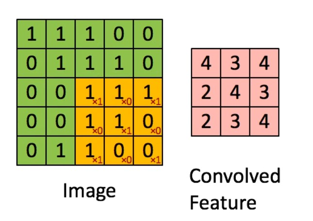

2. 步长 ： 就是卷积核在图像上移动的步幅
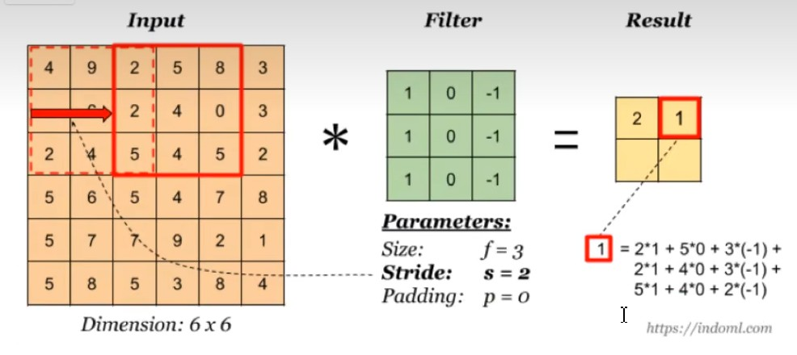

3. padding : 卷积之后图片的长宽会变小，如果保持图片大小不变，我们需要在图片周围填充0，padding指的就是填充的0的圈数
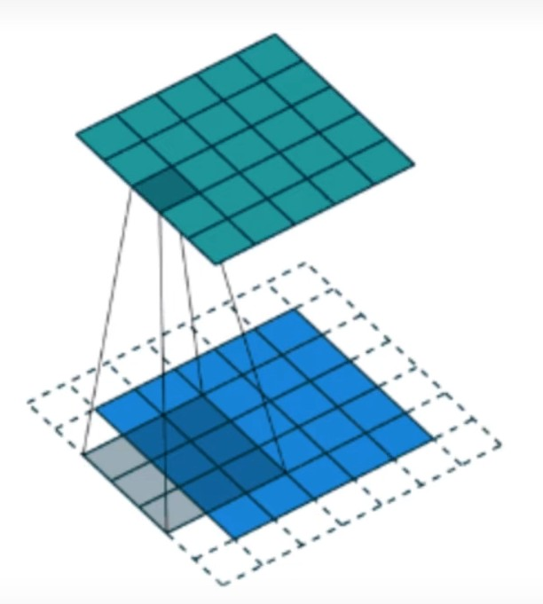

可以通过公式计算需要填充的0的圈数
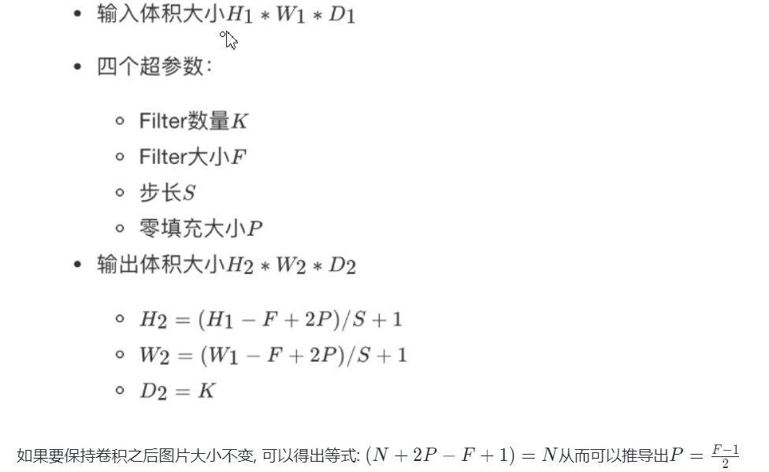

4. 卷积核大小
图片卷积中，卷积核一般为奇数，比如3*3 ， 5*5 。出于以下两个方面的考虑。
    1. 根据上面的padding的计算公式， 如果要保持图片大小不变， 采用偶数卷积核的画， 比如4*4， 将会出现填充1.5圈零的情况。
    2.奇数维度的过滤器有中心，便于指出过滤器的位置， 即OpenCV卷积中的锚点。

5. 卷积案例

    5.1. filter2D(src, ddepth, kernel,[,dst[,anchor[, delta[, borderType]]]])

        ddepth ： 是卷积之后的图片的位深， 即卷积之后图片的数据类型， 一般设为-1 ， 表示和原图类型一致。
        kernel ： 卷积核大小， 用元组或者ndarray表示， 要求数据类型必须是float型。
        anchor锚点 ： 即卷积核的中心点， 是可选参数， 默认是(-1, 1)。
        delta（可选参数） ： 表示卷积之后额外加的一个值， 相当于线性方程中的偏差， 默认是0.
        borderType边界类型 ： 一般不设。

    5.2. 方盒滤波与均值滤波
        boxFilter(src, ddepth, ksize,[,dst[,anchor[,normalize[,,borderType]]]])

        卷积核的形式如下
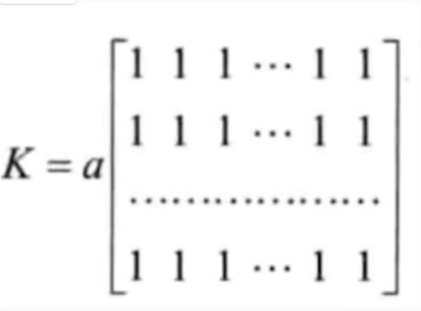
        normalize = True时 ， a=1/(W*H) 滤波器的宽高
        normalize = True时 ， a=1

    5.3. 均值滤波
        blur(src, ksize,[,dst[,anchor[,borderType]]])

    5.4. 高斯滤波
        高斯函数 ： 符合高斯分布(也叫正态分布)的数据的概率密度函数
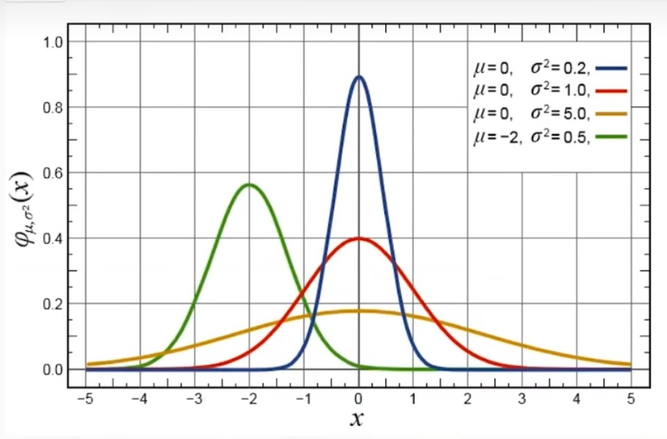

        高斯函数的特点 ： 是以x轴某一点（这一点称为均值）为对称轴， 越靠近中心数据发生的概率越高， 最终形成一个两边平缓， 中间陡峭的钟形图形

        高斯函数的一般形式 ：
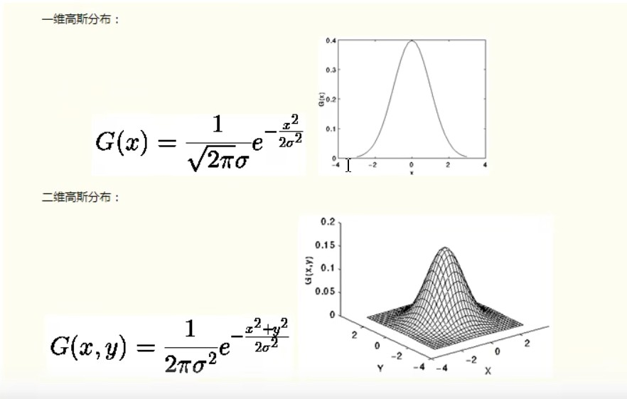

        高斯滤波就是使用符合高斯分布的卷积核对图片进行卷积操作， 所以高斯滤波的重点就是如何计算符合高斯分布的卷积核， 即高斯模板

        假定中心点的坐标是(0,0), 那么取距离它最近的8个坐标，为了计算， 需要设定 $ \sigma $ 的值， 假定 $ \sigma $ = 1.5 ，则模糊半径为1的高斯模板如下
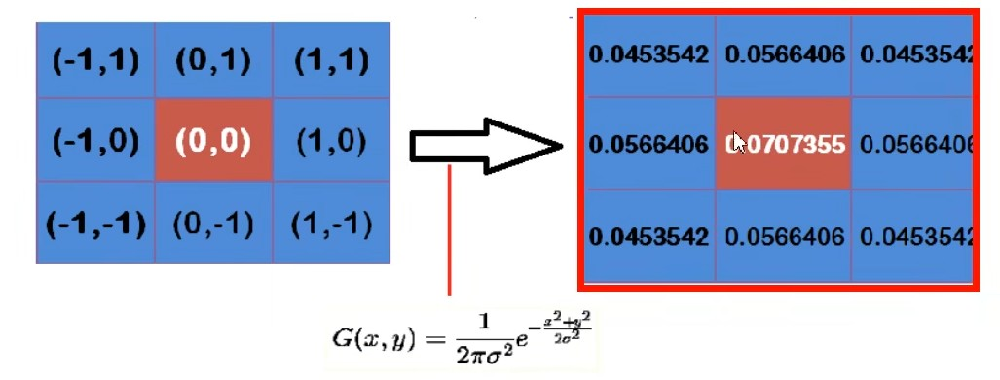
$G(x,y) =  \frac{1}{2 \pi \sigma^2}e^{-\frac{x^2+y^2}{2\sigma^2}} $
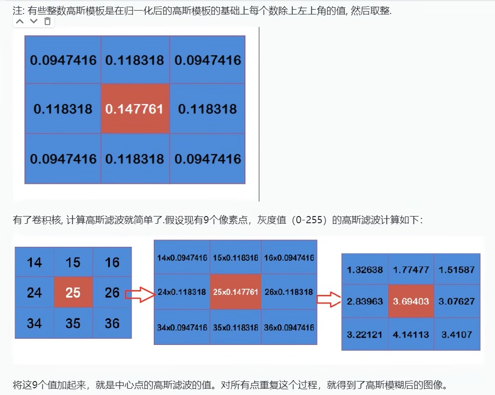

        GaussianBlur(src, ksize, sigmaX[, dst[, sigmaY[,borderType]]])
            kernel 高斯核的大小
            sigmaX ， X轴的标准差
            sigmaY ， Y轴的标准差 ，默认为0， 这时时 sigmaX = sigmaY
            如果没有指定的sigma值， 会分别从ksize的宽度和高度中计算sigma
        选择不同的sigma值会得到不同的平滑效果， sigma越大， 平滑效果越明显
        没有指定sigma时， ksize越大， 平滑效果越明显
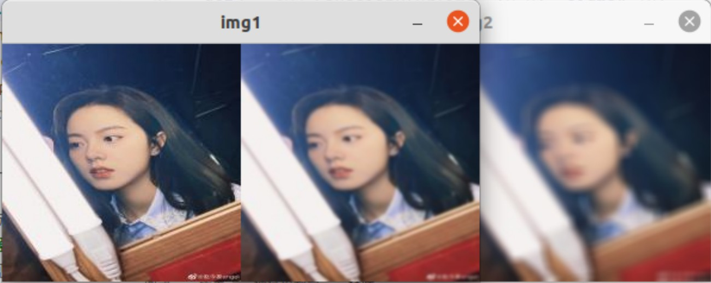 

    5.5. 中值滤波
        原理： 假设其中的中间值(即中位数)作为卷积后的结果值即可。 中值滤波对胡椒噪音效果明显

    5.6. 双边滤波
        对于图像边缘信息能够更好的保存， 其原理为一个与空间距离相关的高斯函数与一个灰度距离相关的高斯函数相乘。
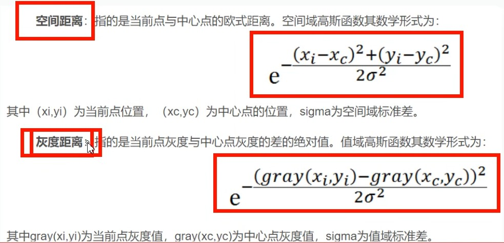
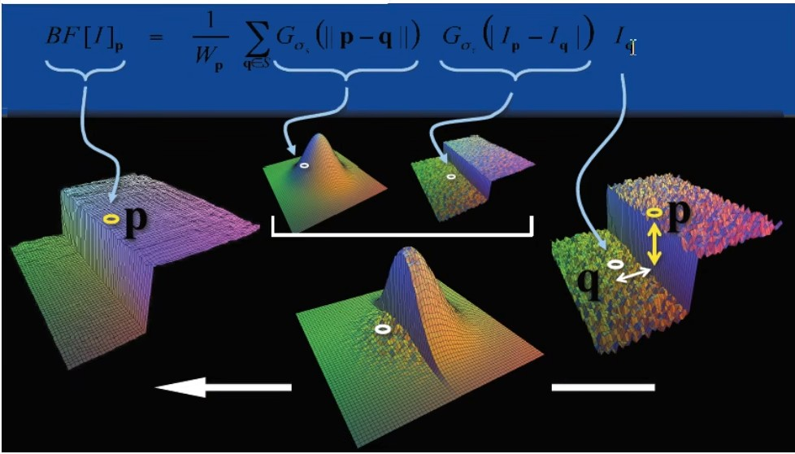 

        bilateralFilter(src, d, sigmaColor, sigmaSpace[, dst[, borderType]])
            sigmaColor 是计算像素信息使用的sigma
            sigmaSpace 是计算空间信息使用的sigma

        