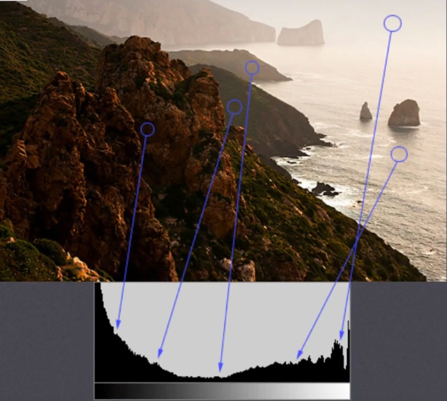
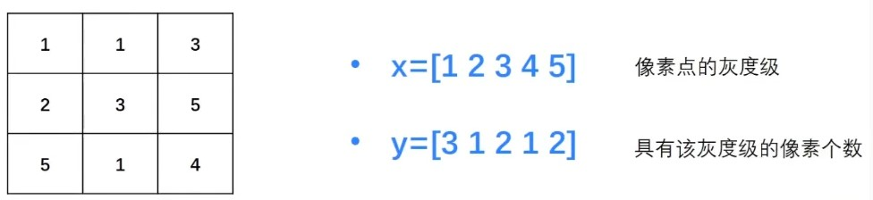
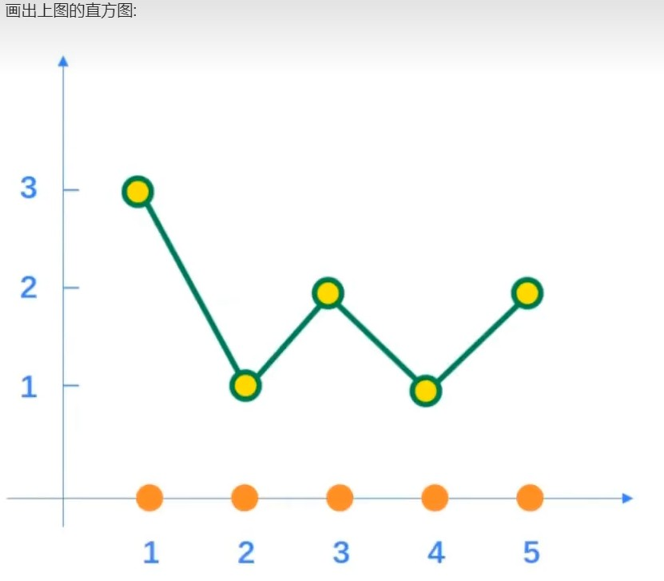
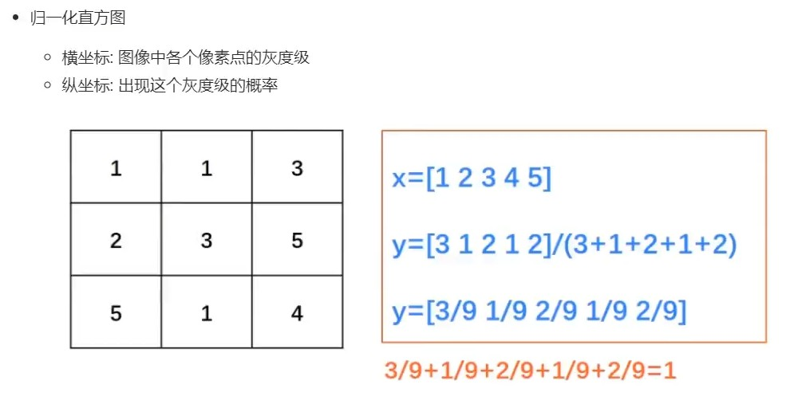
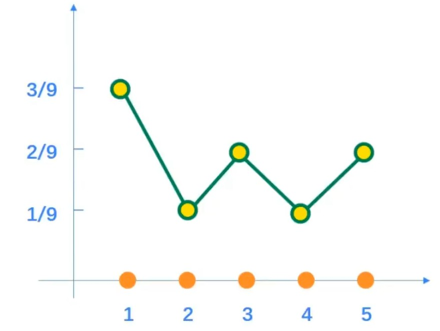
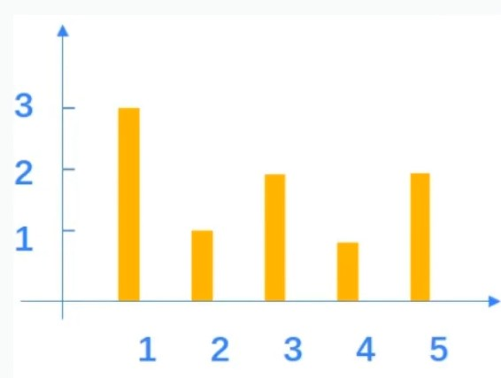
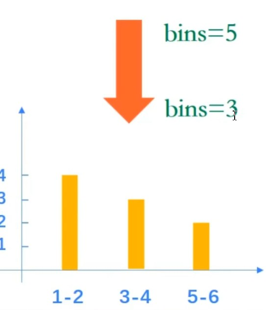
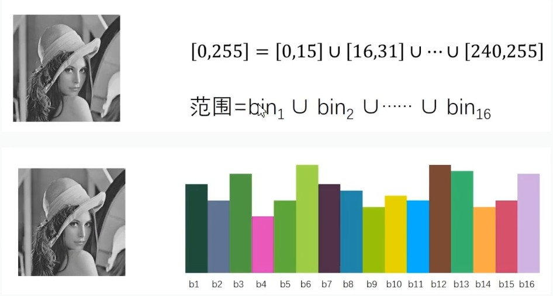

# 图像直方图
## 图想直方图的基本概念

在统计学中，直方图是一种对数据分布情况的图形表示，是一种二维统计图表
图像直方图是用一表示数字图像中亮度分布的直方图，标绘了图像中每个亮度值的像素数。可以借助观察该直方图了解需要如何调整亮度分布的直方图。这种直方图中，横坐标的左侧为纯黑、较暗的区域，而右侧为较亮、纯白的区域。因此，一张较暗图片的图像直方图中的数据多集中于左侧和中间部分，而整体明亮、只有少量阴影的图像则相反

    横坐标: 图像中各个像素点的灰度级
    纵坐标:具有该灰度级的像素个数

## 归一化直方图
    横坐标 ： 图像中各个像素点的灰度级
    纵坐标 ： 出现这个灰度级的概率

## 直方图术语
dims : 需要统计的特征的数目。例如: dims=1，表示我们仅统计灰度值。
bins : 每个特征空间子区段的数目。

range : 统计灰度值的范围， 一般为[0, 255]

# 使用OpenCV统计直方图

    calcHist(images, channels, mask, histSize, ranges[, hist[, accumulate]])

        images : 原始图像
        channels : 指定通道
            (需要用中括号括起来,输入图像是灰度图像是,值是[0]; 彩色图像可以是[0],[1],[2],分别对应B,G,R)
        mask : 掩码图像
            (统计整幅图像的直方图,设为None;
            统计图像某一部分的直方图时,需要掩码图像)
        histSize : BINS的数量
            (需要用中括号括起来,例如[256])
        ranges : 像素值范围,例如[0255]
        accumulate : 累积标识
            (默认值为False;
            如果被设置为True,  则直方图在开始分配时不会被清零;
            该参数允许从多个对象中计算单个直方图，或者用于实时更新直方图;
            多个直方图的累积结果，用于对一组图像计算直方图)

# 使用OpenCV绘制直方图
可以利用matplotlib把OpenCV统计得到的直方图绘制出来