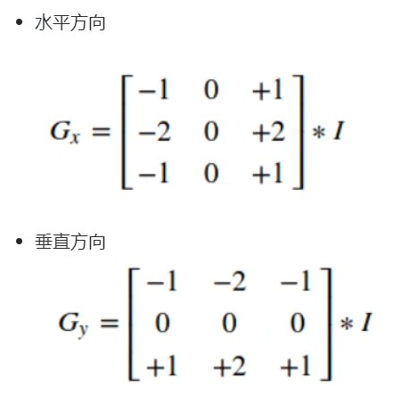
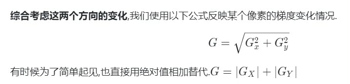
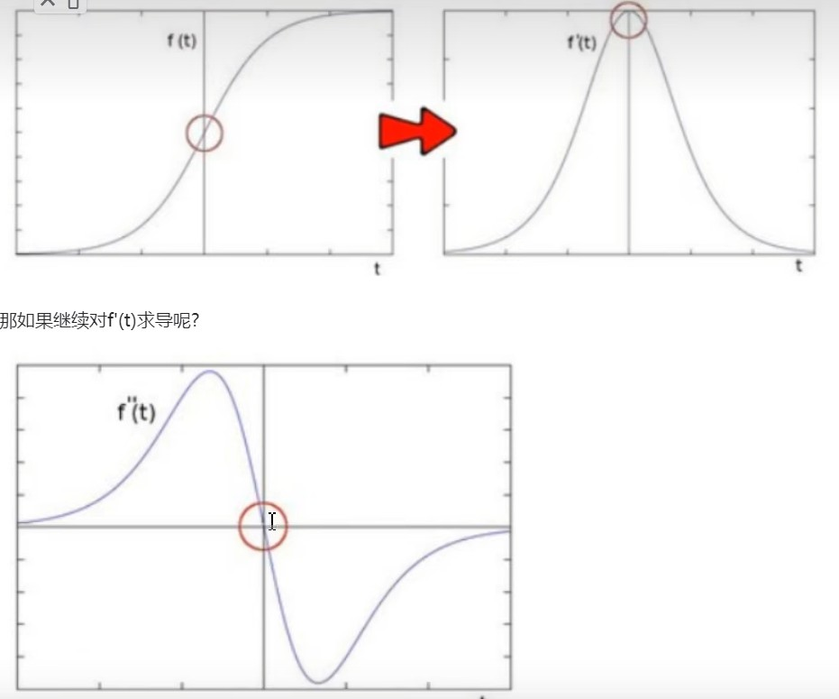
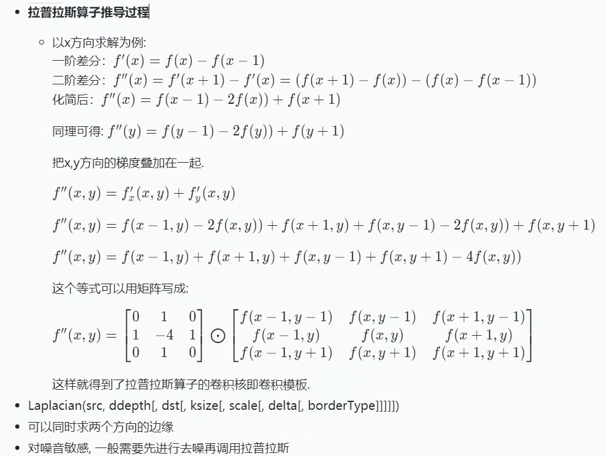
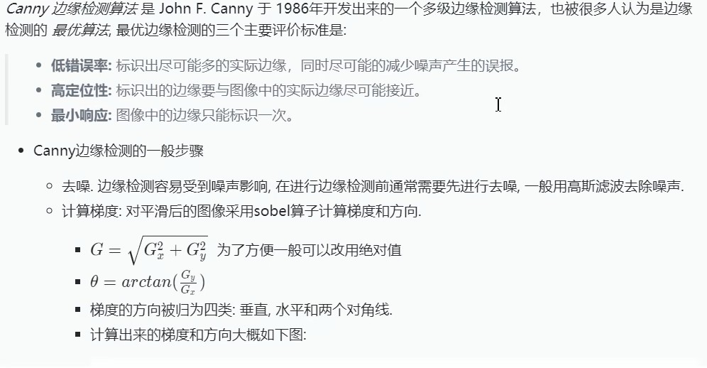
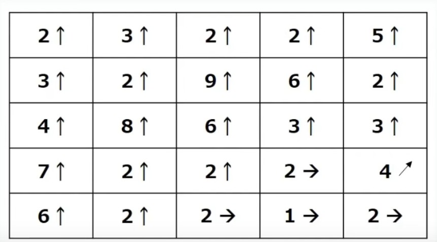
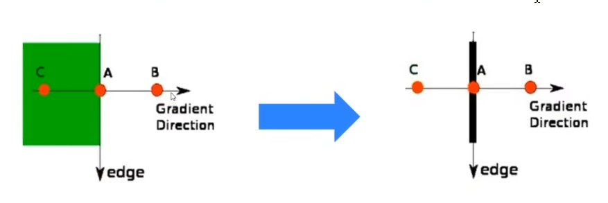
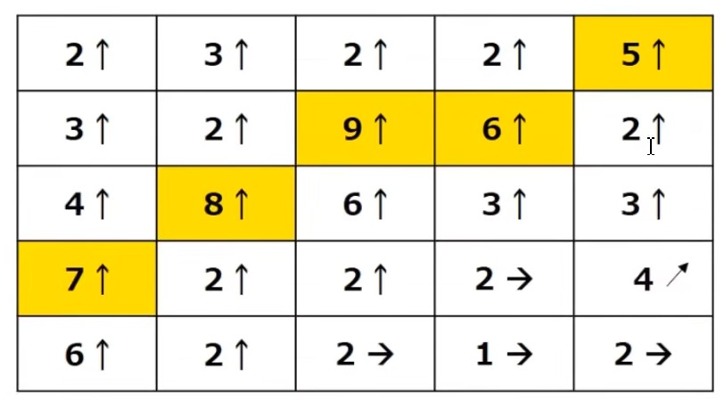
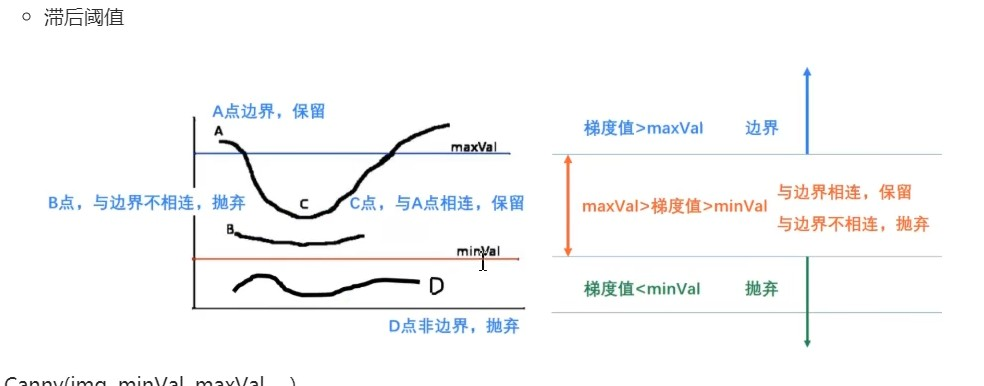

# 边缘
   边缘时像素发生跃迁的位置， 是图像的显著特镇之一， 在图像特征提， 对象检测，模式识别等方面都有重要的作用。

人眼如何识别图像边缘？
    比如有一张图， 图里面有一条线，左边很亮，右边很暗，那么眼睛容易识别这条线作为边缘， 也就是像素灰度值快速变化的地方

# 索贝尔(sobel)算子
sobel算子对图像求一阶导数， 一阶导数越大， 说明像素在该方向的变化越大， 边缘信号处理似梯度。

图像时二维的， 沿着宽度/高度两个方向。于是我们使用两个卷积核对原图像进行处理：

得到的两个新的矩阵， 分别反映了每个像素在水平方向上的亮度辩护情况 和 在垂直方向上的亮度变换情况。

# 沙尔(Scharr)算子
Scharr(src, ddepth, dx, dy,[, dst[, scale[, delta[, borderType]]]])
当内核大小为3时， 以上Sobel内核可能产生比较明显的误差，因为Sobel算子只是求取导数的近似值。 Scharr函数仅作用于大小为3的内核。运算速度与sobel一样，结果更精准。
Scharr 使用的是kernel值， 放大了像素变换的情况。

特点：
    1. Scharr算子仅支持3*3的俄kernel，所以没有kernel参数
    2. Scharr算子只能求x方向或y方向的边缘
    3. Sobel算子的ksize设为-1就是Scharr算子

# 拉普拉斯算子
索贝尔算子时模拟一阶求导， 导数越大的地方说明变换越剧烈， 越有可能是边缘。

边缘处的二阶导=0， 利用特性区寻找图像边缘， 但二阶求导为0的位置可能时无意义的位置

Laplacian(src, ddepth[, dst[, ksize[, delta[, borderType]]]])
可以同时求两个方向的边缘
对噪音敏感， 一般需要进行去噪在调用拉普拉斯

# Canny

Canny(img, minVal, maxVal, ...)
